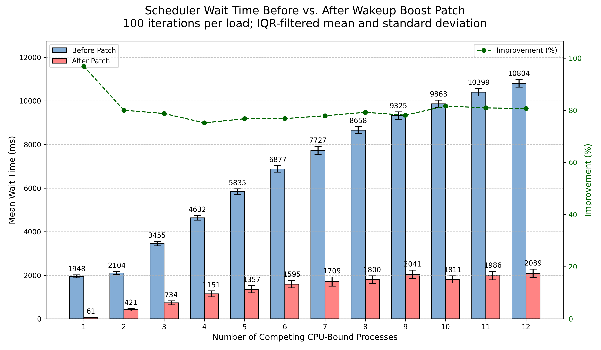

# One-shot wakeup boost for long uninterruptible sleeps

This project modifies the Linux 6.13.9 fair scheduler to give tasks waking from an uninterruptible sleep a temporary, one-shot `vruntime` boost. The objective is to reduce the time that an I/O-like task remains runnable but waiting for the CPU when the system is under heavy CPU contention.

A complete benchmark of the final implementation was run on August 25, 2026, with 100 iterations for each load from 1 to 12 competing CPU-bound processes. The IQR-filtered scenario means show a reduction in target-task `wait_sum` between 75.2% and 96.9%, with an equal-weight mean reduction of 79.5% across the 12 scenarios.

The implementation can be reviewed directly in [the kernel patch](patches/0001-sched-fair-boost-wakeups-after-long-uninterruptible-sleeps.patch), while the complete discussion and methodology are available in [the project report](report/project_report.pdf).

## Linux kernel and tools

The Linux kernel source is intentionally not tracked in this repository. Linux 6.13.9 can be downloaded from [kernel.org](https://cdn.kernel.org/pub/linux/kernel/v6.x/linux-6.13.9.tar.xz), or downloaded and checksum-verified automatically with:

```bash
./prepare_kernel.sh
```

The extracted `linux-6.13.9/` directory remains local and is ignored by Git. BusyBox 1.36.1 is kept in the repository because it supplies the small guest userspace used by the test environment.

The main tools used are an ARM cross-compiler, QEMU, BusyBox, Python 3, NumPy and Matplotlib. The original one-time environment setup is available in `build_embedded_linux.sh`.

## Benchmark configuration

By default, `wakeup_boost_test.sh` runs one practical scenario with 6 CPU-bound children and 3 main iterations:

```bash
sudo ./wakeup_boost_test.sh \
  0001-sched-fair-boost-wakeups-after-long-uninterruptible-sleeps.patch
```

The number of children and iterations can be changed without editing the script. For example, the complete experiment can be requested with:

```bash
sudo env FORK_COUNTS="1 2 3 4 5 6 7 8 9 10 11 12" MAIN_ITERATIONS=100 \
  ./wakeup_boost_test.sh \
  0001-sched-fair-boost-wakeups-after-long-uninterruptible-sleeps.patch
```

The reason for the smaller default is simple: the complete 12-scenario, 100-iteration run took just over 14 hours on the machine used for the final benchmark. Generated raw logs are stored under `.build/results/` and are not tracked by Git; the final comparison graph is included in `report/benchmark_comparison.png`.

The script first checks that the source is vanilla, benchmarks it, applies the patch atomically, benchmarks the modified kernel and then reverses the exact patch on exit. This also happens when the script is interrupted, as long as the source files are still in a state where the patch can be reversed.

## Isolating two host CPUs

To benchmark the vanilla and modified kernels with less interference from the host scheduler, logical CPUs 2 and 3 were isolated on the Ubuntu 24.04.4 host used for the final run. QEMU is restricted to this host CPU set and exposes two virtual CPUs to the guest; this reduces host-side noise but does not create a guaranteed one-to-one mapping between each host CPU and guest vCPU. On the i7-6700 benchmark host, CPUs 2 and 3 belong to separate physical cores, although their SMT siblings 6 and 7 were not isolated.

The benchmark host used this GRUB setting:

```text
GRUB_CMDLINE_LINUX_DEFAULT="quiet splash isolcpus=2,3"
```

After changing GRUB, run `sudo update-grub` and reboot the host. CPU numbers must be adapted to the machine being used, and they should be checked before starting a long run. The benchmark also uses real-time priority through `chrt`, therefore the complete script is run with `sudo`.

Inside the guest, the CPU-bound processes and the target I/O-like process are both pinned to vCPU 1. This is intentional: they have to share the same guest runqueue for the scheduler modification to be measured. Guest vCPU 0 remains available for the other operating-system work.

## Results and limitations

`benchmark_analyzer.py` removes IQR outliers independently for each load scenario when at least four samples are available, then calculates the mean and standard deviation. The primary value is `wait_sum` from `/proc/[pid]/sched`, measured across one complete `io_load` invocation of 5,000 reads.

All 12 scenarios improved with and without outlier filtering. The raw equal-weight mean reduction was 79.5%; IQR filtering removed 21 of 1,200 vanilla samples and 30 of 1,200 patched samples without changing the overall conclusion.



The workload is deliberately synthetic: the character device forces an uninterruptible sleep and the patch gives a one-shot boost to a wakeup after a sleep longer than 1 ms. Uninterruptible sleep is not exclusive to real I/O, and the current experiment does not measure fairness, throughput or starvation effects on the competing CPU-bound tasks. See the report for the complete interpretation.

## License

Unless a file or bundled upstream component states otherwise, the original project code and documentation are licensed under the GNU General Public License version 2 only (`GPL-2.0-only`); see `LICENSE`. The kernel patch follows the licensing of the Linux source files it modifies. BusyBox keeps its own upstream license and notices.
